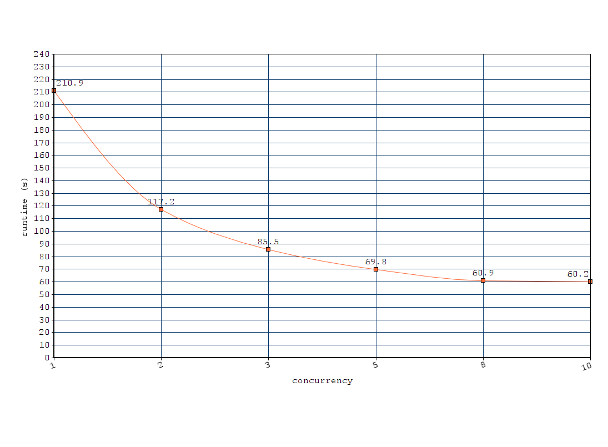

# Simple Java client for GROBID REST services

This Java project can be used to process in an efficient concurrent manner a set of PDF in a given directory by the [GROBID](https://github.com/kermitt2/grobid) service. Results are written in a given output directory and include the resulting XML TEI representation of the PDF. 

## Build and run

You need first to install and start the *grobid* service, latest stable version, see the [documentation](http://grobid.readthedocs.io/). It is assumed that the server will run on the address `http://localhost:8070`. You can change the server address by editing the file `grobid-client.properties`.

Build the client:

> mvn clean install

## Usage

Parameters: 

* `-in`: path to the directory containing the PDF files to process 

* `-out`: path to the directory where to put the results

* `-exe`: GROBID service to be used, one of `[processFulltextDocument, processHeaderDocument, processReferences]` (default `processFulltextDocument`)

* `-n`: concurrency for service usage (default 10)

For example: 

> java -jar target/org.grobid.client-0.5.4-SNAPSHOT.one-jar.jar -in ~/tmp/in2 -out ~/tmp/out -exe processFulltextDocument

This command will process all the PDF files present in the input directory (files with extension `.pdf` only) with the `processFulltextDocument` service of GROBID, and write the resulting XML TEI files under the output directory, reusing the file name with a different file extension (`.tei.xml`), using the default `10` concurrent workers.

> java -jar target/org.grobid.client-0.5.4-SNAPSHOT.one-jar.jar -in ~/tmp/in2 -out ~/tmp/out -n 20 -exe processHeaderDocument

This command will process all the PDF files present in the input directory (files with extension `.pdf` only) with the `processHeaderDocument` service of GROBID, and write the resulting XML TEI files under the output directory, reusing the file name with a different file extension (`.tei.xml`), using `20` concurrent workers.

## Benchmarking

Full text processing of __136 PDF__ (total 3443 pages, in average 25 pages per PDF) on Intel Core i7-4790K CPU 4.00GHz, 4 cores (8 threads), 16GB memory, n being the concurrency parameter:

| n  | runtime (s)| s/PDF | 
|----|------------|-------|
| 1  | 210.9  | 1.55      | 
| 2  | 117.2  | 0.86      |
| 3  | 85.5   | 0.63      |
| 5  | 69.8   | 0.51      |
| 8  | 60.9   | 0.45      |
| 10 | 60.2   | 0.44      |

As complementary info, GROBID processing of header, with of the 136 PDF and with `n=10` takes 3.82 s (more than 15 times faster than the complete full text processing because only the two first pages of the PDF are considered). In similar conditions, extraction and structuring of bibliographical references takes 27.9 s.

## Todo

Benchmarking with more files (e.g. million ISTEX PDF). Also implement existing GROBID services for text input (date, name, affiliation/address, raw bibliographical references, etc.). Better support for parameters (including elements where to put coordinates).

## License

Distributed under [Apache 2.0 license](http://www.apache.org/licenses/LICENSE-2.0). 

Main author and contact: Patrice Lopez (<patrice.lopez@science-miner.com>)
